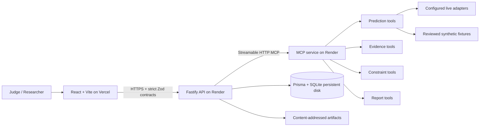

# ImmunoGraph

From protein sequence to an auditable epitope shortlist—without allowing an LLM to invent biological evidence.

**BlockseBlock Codex Track 4 — Domain Agents** · MCP-native scientific decision support · human-governed · deterministic offline judge demo

> ImmunoGraph is a computational demonstration, not a vaccine-discovery, clinical-decision, or experimental-validation system.

## 1. Live demo and three-minute video

The public URLs are added only after the owner deploys and verifies the exact submitted commit. This repository never publishes a fabricated demo or video link. The final publication fields and visibility checks are in [the submission checklist](docs/SUBMISSION_CHECKLIST.md).

## 2. Launch the judge demo

1. Open the deployed web application.
2. Select **Launch judge demo**—no account or credentials are required.
3. Follow the six-step rail: **Input → Configure → Run → Evidence → Approve → Report**.
4. Open **Scientific Trust Center** to inspect provenance, approval snapshots, and SHA-256 evidence.

Each launch creates an isolated UUID workspace backed only by a reviewed synthetic fixture. Browser state contains only the project ID, run ID, and expiry; the workspace expires after 24 hours.

## 3. Problem and focused outcome

Epitope prioritization often means reconciling incompatible predictor formats, score directions, fallback behavior, biological constraints, and spreadsheets. A shortlist can look authoritative while hiding where a value came from or whether a human approved it.

ImmunoGraph produces one focused outcome: a reproducible, researcher-approved computational shortlist whose inputs, source states, rules, rankings, approvals, and exports remain inspectable.

## 4. Why ImmunoGraph is original

- **Evidence is a graph, not a paragraph.** Candidates stay connected to predictor executions, constraints, rankings, and approval snapshots.
- **An agent coordinates typed tools but cannot author biology.** The workflow supervisor and MCP contracts control scientific operations; optional LLM prose cannot create or mutate scores.
- **Fallback is visible.** `LIVE`, `CACHED`, `SYNTHETIC`, `FIXTURE`, and `FAILED` never collapse into one confidence label.
- **Abstention is a feature.** Missing or conflicting evidence remains `UNAVAILABLE`, `REVIEW`, `REJECTED`, `PARTIAL`, or `FAILED` rather than becoming a fabricated answer.
- **Trust is inspectable.** The Trust Center exposes six independent checks instead of an invented aggregate trust percentage.

## 5. Three-minute product walkthrough

| Time | Judge action | Technical evidence |
|---|---|---|
| 0:00–0:25 | Launch Judge Mode | Credential-free, isolated, expiring fixture workspace |
| 0:25–0:50 | Inspect input and approve configuration | Protein/configuration hashes and an explicit human gate |
| 0:50–1:20 | Start the run and open workflow | Server-recorded stages and fixture-only source state |
| 1:20–1:55 | Review candidates and constraints | Track-specific ranking, rejections, and provenance |
| 1:55–2:20 | Approve a shortlist | Snapshot-bound decision; report remains locked beforehand |
| 2:20–2:45 | Open Scientific Trust Center | Manifest, provenance, constraints, approvals, abstention, hashes |
| 2:45–3:00 | Generate and download report | Content-addressed JSON/CSV/evidence/workflow artifacts |

The exact narration and fallback path are in [the demo script](docs/DEMO_SCRIPT.md).

## 6. Product visual


The release ledger records desktop and Pixel 7 screenshots produced by the browser suite; generated screenshots and traces are intentionally excluded from source control.

## 7. System and MCP architecture



The web client has no database or secret-bearing dependency. The API owns mutation, approvals, isolation, retention, and artifacts. The separately deployable MCP service validates every tool request and response. Judge Mode remains operational through the exact fixture path when optional external predictors are unavailable.

See [architecture](docs/ARCHITECTURE.md), [agent contract](docs/AGENT_SPEC.md), and [MCP contract](docs/MCP_SPEC.md).

## 8. Deterministic scientific and safety boundaries

- Scientific values come from identified connector outputs, exact cache hits, deterministic synthetic demonstrations, or reviewed fixtures—never from an LLM.
- Two fixed, versioned demonstration scoring heads exercise feature, disagreement, and model-integration plumbing. The repository contains no training dataset or validation experiment, so they are not described as trained ML/DL predictors or evidence of biological accuracy.
- Configuration and shortlist approvals are mandatory, immutable snapshot events.
- Fixture and synthetic outputs carry `scientificUse=false` and a non-dismissible disclaimer.
- Experimental 3D structure and docking labs are outside the judged epitope workflow.
- Reports require independent expert review and experimental validation.

Read the full [responsible-use boundary](docs/LIMITATIONS.md) and [security model](docs/SECURITY.md).

## 9. Scientific Trust Center and evaluation evidence

`GET /api/v1/runs/:runId/trust-summary` derives an open evidence view directly from repository records:

| Check | Evidence |
|---|---|
| Fixture manifest integrity | Reviewed fixture metadata and frozen manifest/content hashes |
| Connector provenance completeness | Connector, method, version, source state, and input/output hashes |
| Biological constraints enforced | Immutable rule outcomes recorded before ranking |
| Human approval gates | Configuration and shortlist snapshot hashes |
| Artifact hash verification | SHA-256 for generated JSON, CSV, graph, and trace artifacts |
| Abstention visible | Explicit review/fail outcomes rather than forced confidence |

Each check returns `PASS`, `FAIL`, or `UNAVAILABLE` with inspectable detail. There is deliberately no aggregate “trust score.”

## 10. How Codex helped build this release

The hackathon hardening was performed as an evidence-backed Codex workflow:

- [approved design specification](docs/superpowers/specs/2026-08-03-hackathon-top-tier-submission-design.md);
- [test-first implementation plan](docs/superpowers/plans/2026-08-03-hackathon-top-tier-submission.md);
- focused commits for demo retention, judge entry, guided workflow, trust evaluation, and end-to-end verification;
- [Codex build log](docs/CODEX_BUILD_LOG.md) with real repository artifacts and boundaries;
- [release verification ledger](docs/superpowers/verification/2026-08-03-hackathon-release.md), created by the final quality gate.

Codex did not manufacture deployment links, scientific accuracy, wet-lab validation, impact statistics, or authorship claims.

## 11. Verified test and build results

The release gate now passes **338 Vitest tests across 81 files** and **11 Playwright tests** across authenticated, credential-free, desktop, and Pixel 7 profiles. Exact coverage, build, audit, container, and browser evidence is recorded—not estimated—in the [release verification ledger](docs/superpowers/verification/2026-08-03-hackathon-release.md).

The required release gate is:

```bash
npm run format:check
npm run lint
npm run typecheck
npm test
npm run test:coverage
npm run build
npm run docs:check
npm run deployment:check
npm run test:e2e
npm audit
```

The credential-free judge journey is exercised in Desktop Chrome and Pixel 7 profiles through launch, both approvals, run execution, Trust Center, report generation, and download—with console errors and horizontal overflow treated as failures.

## 12. Local development

Prerequisites: Node.js 20.19.x and npm 10.x.

```bash
npm ci
npm run db:generate
npm run db:migrate
npm run dev
```

Open `http://127.0.0.1:5173`. The API and MCP defaults are documented in [.env.example](.env.example). The deterministic judge path requires no provider credentials.

Useful checks:

```bash
npm run verify
npm run test:e2e -- --project=judge-chromium
npm run demo:cleanup
```

## 13. Vercel and Render deployment

The committed [Vercel configuration](vercel.json) builds the Vite workspace and rewrites SPA routes. The committed [Render Blueprint](render.yaml) provisions the API, MCP service, and an API persistent disk.

Required values after the first deploy:

- Vercel: `VITE_API_BASE_URL=https://<api-service>.onrender.com/api/v1`
- Render API: `CORS_ORIGINS=https://<web-project>.vercel.app`
- Render API: `MCP_SERVER_URL=http://<mcp-service>:3001/mcp`
- Render API disk: `DATABASE_URL=file:/data/immunograph.db`, `ARTIFACT_ROOT=/data/artifacts`

Use the exact steps and health probes in [the deployment guide](docs/DEPLOYMENT.md). Do not Final Submit until the deployed commit, public repository, video, and Google Doc all match.

## 14. Repository map

```text
apps/web/          React judge and researcher experience
apps/api/          Fastify routes, application services, approvals, artifacts
apps/mcp/          Typed MCP scientific capability server
packages/shared/   Zod API/view contracts
packages/algorithms/ Pure deterministic scientific/demo algorithms
packages/database/ Prisma schema, repositories, fixtures, migrations
data/              Reviewed profiles and synthetic fixtures
tests/e2e/         Credential-free desktop/mobile judge journeys
docs/              Architecture, safety, demo, deployment, and evidence
```

Contributor commands and scientific-change rules are in [CONTRIBUTING.md](CONTRIBUTING.md); agent-specific safeguards are in [AGENTS.md](AGENTS.md).

## 15. Limitations

ImmunoGraph does not establish binding affinity, immunogenicity, safety, efficacy, population benefit, or clinical suitability. The public deployment contains demonstration data only, offers best-effort 24-hour retention, and is not a multi-tenant research-data service. Optional live tools can be unavailable or license-restricted. See [all limitations](docs/LIMITATIONS.md).

## 16. Authoritative scientific and technical sources

- [IEDB Analysis Resource](https://tools.iedb.org/main/) for documented epitope-analysis tools.
- [MHCflurry documentation](https://openvax.github.io/mhcflurry/) for the optional local MHC-I connector.
- [RCSB Protein Data Bank](https://www.rcsb.org/) for the experimental structure source used only by the optional structure lab.
- [Model Context Protocol](https://modelcontextprotocol.io/) for the typed tool boundary.

Project-specific assumptions, profile versions, fixture hashes, and source-state rules remain authoritative in this repository—not in generated prose.

## 17. License

Released under the [MIT License](LICENSE). Scientific tools, datasets, and external services retain their own terms and licenses.
