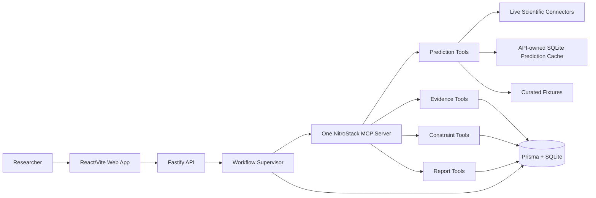
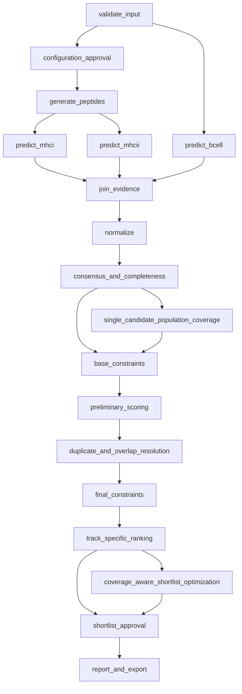
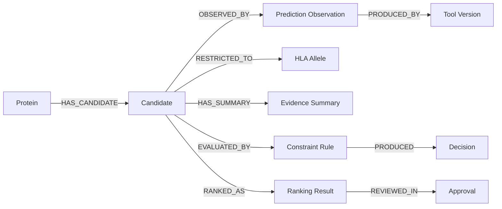

# System Architecture

## 1. Architectural objective

ImmunoGraph is a local-first, single-researcher workspace. The architecture isolates four concerns:

1. researcher interaction;
2. workflow control and approvals;
3. typed scientific capabilities;
4. deterministic evidence and decision logic.

Scientific connector failure is expected and modeled. It must not become silent data substitution.

### Public hackathon topology

The release profile deploys the React/Vite client to Vercel and two Render services: a Fastify API with a persistent `/data` disk, and a stateless MCP server. `VITE_API_BASE_URL` selects the API; exact `CORS_ORIGINS` restrict browser origins; `MCP_SERVER_URL` uses Render private networking. Judge Mode sends no credentials and stores only its opaque project ID, run ID, and expiry in `sessionStorage`. See [deployment instructions](DEPLOYMENT.md).

## 2. System context



## 3. Deployment topology

### MVP development topology

- `apps/web`: Vite development server.
- `apps/api`: Fastify API and one workflow supervisor process.
- One NitroStack MCP server package, started as one local child process or development service.
- One SQLite database file owned logically by the API/database package.
- Connector subprocesses or HTTP clients invoked only by the Prediction tool module.
- IEDB MHC-I/MHC-II live binding can be enabled with environment flags; optional local MHCflurry can provide MHC-I prediction when its CLI/models are installed; GraphBepi remains fixture-only.

The default bind address is `127.0.0.1`. Remote deployment is outside the MVP security model.

### Process ownership rule

Only the database repository layer writes directly to SQLite. The MCP server receives repository abstractions or calls internal API boundaries; it must not create an unmanaged SQLite connection. This prevents inconsistent transactions and reduces lock contention.

## 4. Monorepo boundaries

```text
apps/
  web/
    src/features/{projects,workflow,candidates,evidence,reports,settings}/
  api/
    src/modules/{projects,runs,approvals,exports,events}/
packages/
  shared/             Shared Zod schemas and TypeScript domain/API types
  algorithms/         Pure deterministic functions; no I/O
  database/           Prisma client, migrations, repositories, fixtures, references
  mcp/                One NitroStack server
    src/prediction/   Prediction tools and resources
    src/evidence/     Evidence tools and resources
    src/constraint/   Constraint tools and resources
    src/report/       Report tools, resources, and prompts
```

### Dependency direction

```text
web -> shared API contracts
api -> shared, database, MCP client, application services
mcp -> shared, algorithms, database loaders, connector capability ports
database -> shared-compatible validation and Prisma
algorithms -> local pure types/helpers only
shared -> zod only
```

Forbidden dependencies:

- `algorithms` must not import Prisma, Fastify, NitroStack, Pino, or network clients.
- `shared` must not import any application package.
- `web` must not import Prisma or connector code.
- connector capability ports must not call the LLM.
- report code must not recalculate or mutate scientific values.

## 5. Domain model

| Entity | Purpose | Stable identity |
|---|---|---|
| `Project` | Research workspace metadata | UUID |
| `ProteinInput` | Original and normalized FASTA input | UUID + SHA-256 |
| `WorkflowRun` | Immutable configuration snapshot plus lifecycle | UUID |
| `WorkflowStage` | One execution node and status | UUID |
| `Candidate` | Peptide or B-cell region being evaluated | UUID + candidate key |
| `PredictionObservation` | Raw output from one method | UUID |
| `NormalizedObservation` | Registered transformation of a raw value | UUID |
| `EvidenceSummary` | Consensus/completeness values for a candidate | UUID |
| `ConstraintOutcome` | One rule’s pass/warn/fail result | UUID |
| `RankingResult` | Versioned component scores and rank | UUID |
| `Approval` | Researcher decision on config or shortlist | UUID |
| `Artifact` | Export or visualization metadata | UUID + SHA-256 |
| `WorkflowEvent` | Append-only observable event | UUID |

### Candidate key

For T-cell candidates:

```text
sha256(proteinHash | candidateType | start | end | peptide | allele)
```

For B-cell regions:

```text
sha256(proteinHash | BCELL | start | end | sequence | methodProfile)
```

Coordinates are one-based and inclusive at API/UI boundaries. Internal string slicing uses zero-based, end-exclusive coordinates and must convert through tested helpers.

## 6. Workflow graph



Disabled analysis branches are recorded as `SKIPPED`, not `COMPLETED`.

## 7. Stage state machine

```text
PENDING -> READY -> RUNNING -> SUCCEEDED
                         |-> FAILED
                         |-> CANCELLED
PENDING/READY -> SKIPPED
FAILED -> READY only through an explicit retry event
```

Every state transition is validated by one transition function and persisted with a workflow event in the same transaction.

## 8. Hybrid connector architecture

Each predictor implements:

```ts
interface PredictorConnector<I, O> {
  readonly descriptor: ConnectorDescriptor;
  healthCheck(): Promise<ConnectorHealth>;
  predict(input: I, signal: AbortSignal): Promise<ConnectorResult<O>>;
}
```

### MCP-first resolution order

```text
1. The Fastify `ScientificWorkflowService` resolves the requested mode and fallback policy.
2. It invokes the separately running NitroStack MCP server over Streamable HTTP.
3. If cache policy permits and an exact valid cached live result exists, return `CACHED`.
4. If live mode is enabled and a connector is configured, call and validate it; cache success and return `LIVE`.
5. On an eligible live/cache failure, use `SYNTHETIC` only when demo mode and policy permit it.
6. Synthetic tools are deterministic, carry `scientificUse=false` and `validationStatus=DEMONSTRATION_ONLY`, and never masquerade as scientific predictors.
7. If synthetic is unavailable or not permitted, look up an exact approved `FIXTURE`.
8. Otherwise fail closed with a typed error.

Current implementation status: the MCP server contains IEDB MHC-I/MHC-II binding adapters, an optional IEDB population-coverage adapter that supports either an explicitly configured compatible HTTP endpoint or IEDB's official standalone Python package, an optional local MHCflurry MHC-I adapter, and a hybrid capability port that can split mixed IEDB/MHCflurry method requests and merge validated provenance. The API workflow passes the validated normalized sequence to MCP for live T-cell binding, sends peptide/HLA associations for population coverage, stores schema-valid live binding results in the SQLite `CacheEntry` repository, and reuses exact matches as `CACHED` provenance on later runs. IEDB population coverage is live when `IEDB_POPULATION_COVERAGE_ENABLED=true` and either `IEDB_POPULATION_COVERAGE_URL` or `IEDB_POPULATION_COVERAGE_SCRIPT_PATH` is configured; otherwise population coverage transparently uses the synthetic/fixture backup path.
```

The default policy is `CACHE_THEN_LIVE_THEN_FIXTURE` with requested execution mode `AUTO`. Explicit requested modes are `AUTO`, `LIVE`, `SYNTHETIC`, and `FIXTURE`; resolved modes persisted on the run are `LIVE`, `SYNTHETIC`, `FIXTURE`, and `HYBRID`.

### GraphBepi MVP exception

GraphBepi is registered as `FIXTURE_ONLY` and does not enter the generic live/cache resolution order. The resolver performs only an exact approved fixture lookup. It returns `FIXTURE` on success or `FAILED` on absence/mismatch. Configuration validation rejects GraphBepi when the selected fallback policy does not permit fixtures.

### Eligible fixture fallback reasons

- network unavailable;
- connector health check failed;
- timeout;
- HTTP 429/rate limit;
- explicitly enabled demo mode.

Invalid scientific output, schema mismatch, hash mismatch, or unsupported parameters do not permit a loosely matched fixture.

## 9. Agent and MCP relationship

Agents are bounded workflow roles, not free-running chatbots. The supervisor selects the next graph node deterministically. An agent may choose among a small allowlist of MCP calls when a connector retry or route decision is needed.

```text
Supervisor: owns state machine and dependency readiness
Validation Agent: validation tools only
Prediction Agent: prediction tools only
Evidence Agent: evidence tools only
Constraint Agent: constraint tools only
Ranking Agent: evidence ranking tools only
Report Agent: report tools only
```

See [AGENT_SPEC.md](AGENT_SPEC.md).

## 10. Data flow and immutability

1. The original FASTA is stored as an artifact.
2. Normalization creates a separate canonical sequence.
3. Prediction observations are append-only.
4. Normalized observations reference raw observations.
5. Constraint outcomes reference the evidence snapshot they evaluated.
6. Rankings reference the rule and ranking profile versions.
7. A new configuration creates a new run revision; it does not mutate a completed run.

## 11. Evidence graph

SQLite stores graph nodes and edges as relational records. React Flow renders a view model; it is not the graph database.



Allowed edge types are an enum. Arbitrary model-generated edges are forbidden.

## 12. API communication

- Commands and queries use REST JSON.
- Workflow updates use Server-Sent Events at `/api/v1/runs/:runId/events`.
- Large artifacts are downloaded as files through an artifact endpoint.
- Every request accepts or receives a `requestId`; workflow commands also receive a `runId`.

## 13. Failure behavior

| Failure | Behavior |
|---|---|
| Invalid FASTA | Reject before run approval. |
| One predictor fails, fixture exists | Continue with `FIXTURE`; mark run quality. |
| One predictor fails, no fixture | Continue only if the configured track still has required evidence; otherwise mark branch/run partial. |
| All predictors fail | Stop before ranking. |
| Population service fails | Candidates may be `REVIEW`; no population claim is generated. |
| Constraint engine error | Stop; never rank unvalidated candidates. |
| LLM explanation fails | Use deterministic explanation template. |
| Export generation fails | Preserve approved run; allow export retry. |
| Database transaction fails | Emit no success event; return typed infrastructure error. |

## 14. Concurrency and cancellation

- Independent prediction branches run with `Promise.allSettled` behind a concurrency limiter.
- A run-level `AbortController` propagates cancellation.
- Connector-specific timeouts create child abort signals.
- Retry is allowed only for transient errors and uses bounded exponential backoff with jitter.
- Deterministic algorithm stages do not retry; they either succeed or expose a code defect/data error.

## 15. Configuration ownership

| Configuration | Source |
|---|---|
| Ports and paths | Environment variables validated at startup |
| Scientific methods | Versioned connector registry |
| Rule thresholds | Versioned rule profile in data/reference |
| Ranking weights | Versioned ranking profile |
| Fallback policy | Run configuration snapshot |
| LLM provider/model | Optional environment configuration |

No default scientific threshold may live only as a magic number in application code.
