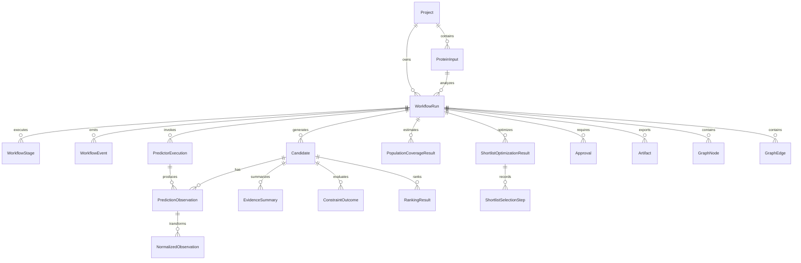

# Database Schema

## 1. Storage choice

The MVP uses Prisma with SQLite. SQLite runs in WAL mode, foreign keys are enabled, and the API process owns write transactions.

Use string columns plus shared Zod parsing for domain enums and canonical JSON payloads so behavior does not depend on database-specific enum or JSON features.

## 2. Conventions

- Primary keys: UUID strings.
- Timestamps: UTC `DateTime`.
- Booleans: Prisma `Boolean`.
- JSON payloads: canonical JSON in `String` columns named `*Json`.
- Hashes: lowercase 64-character SHA-256 hex.
- Coordinates: one-based inclusive.
- Scientific observations are append-only.
- `createdAt` is immutable; `updatedAt` is used only for mutable workflow/control rows.

## 3. Entity relationship diagram

## 4. Logical tables

### `Project`

| Column | Type | Constraints |
|---|---|---|
| `id` | String | PK UUID |
| `name` | String | 1–120 chars |
| `organism` | String? | max 200 |
| `proteinName` | String? | max 200 |
| `description` | String? | max 2,000 |
| `createdAt` | DateTime | indexed |
| `updatedAt` | DateTime | mutable metadata only |

### `ProteinInput`

| Column | Type | Constraints |
|---|---|---|
| `id` | String | PK |
| `projectId` | String | FK Project |
| `originalFasta` | String | max 1 MiB API limit |
| `header` | String | max 500 |
| `normalizedSequence` | String | strict alphabet |
| `sequenceLength` | Int | positive |
| `sha256` | String | indexed |
| `validationProfileVersion` | String | required |
| `createdAt` | DateTime | required |

Index `(projectId, sha256)`.

### `WorkflowRun`

| Column | Type | Constraints |
|---|---|---|
| `id` | String | PK |
| `projectId` | String | FK |
| `proteinInputId` | String | FK |
| `revision` | Int | unique per project, positive |
| `status` | String | Zod RunStatus |
| `quality` | String? | `COMPLETE`, `PARTIAL`, `FIXTURE_ONLY` |
| `configurationJson` | String | immutable run snapshot; profile entries contain only `name`, `version`, and SHA-256 `hash` |
| `configurationHash` | String | SHA-256 |
| `ruleProfileVersion` | String | required |
| `rankingProfileVersion` | String | required |
| `requestedExecutionMode` | String? | `AUTO`, `LIVE`, `SYNTHETIC`, or `FIXTURE`; immutable request intent |
| `executionMode` | String? | resolved `LIVE`, `SYNTHETIC`, `FIXTURE`, or `HYBRID` |
| `replayHash` | String? | set after ranking |
| `failureCode` | String? | typed code |
| `createdAt` | DateTime | indexed |
| `startedAt` | DateTime? |  |
| `completedAt` | DateTime? |  |
| `updatedAt` | DateTime | control state only |

Unique `(projectId, revision)`; indexes `(status, createdAt)` and `proteinInputId`.

Profile definitions are not database entities. Immutable definitions are loaded and validated from `data/profiles/`; a run snapshot stores only each selected profile's `name`, `version`, and content hash inside `configurationJson`. SQLite must not contain `RuleProfile`, `WeightProfile`, or `BiologicalConstraint` tables.

### `WorkflowStage`

`id`, `runId`, `stageKey`, `attempt`, `status`, `dependencyKeysJson`, `inputHash`, `outputHash?`, `progress?`, `errorCode?`, `startedAt?`, `completedAt?`, `createdAt`, `updatedAt`.

Unique `(runId, stageKey, attempt)`.

### `WorkflowEvent`

`id`, `runId`, `stageId?`, `sequenceNumber`, `eventType`, `level`, `message`, `payloadJson`, `createdAt`.

Unique `(runId, sequenceNumber)`. Events are append-only and sequence numbers are allocated transactionally.

### `PredictorExecution`

`id`, `runId`, `stageId`, `connectorId`, `connectorVersion`, `method`, `methodVersion`, `status`, `sourceStatus`, `parametersJson`, `inputHash`, `outputHash?`, `cacheKey?`, `fixtureId?`, `attemptCount`, `errorCode?`, `startedAt`, `completedAt?`.

`sourceStatus` is one of `LIVE`, `CACHED`, `SYNTHETIC`, `FIXTURE`, `FAILED`.

### `Candidate`

`id`, `runId`, `candidateKey`, `candidateType`, `peptide`, `start`, `end`, `length`, `allele?`, `createdAt`.

Unique `(runId, candidateKey)`; indexes `(runId, candidateType)` and `(runId, start, end)`.

### `PredictionObservation`

`id`, `runId`, `candidateId`, `predictorExecutionId`, `rawScoresJson`, `unitsJson`, `inputHash`, `outputHash`, `observedAt`, `createdAt`, `supersedesId?`.

No update or delete through normal repositories.

### `NormalizedObservation`

`id`, `runId`, `candidateId`, `predictionObservationId`, `field`, `rawValue`, `normalizedValue`, `profileVersion`, `transformationJson`, `createdAt`.

Unique `(predictionObservationId, field, profileVersion)`.

### `EvidenceSummary`

`id`, `runId`, `candidateId`, `snapshotHash`, `bindingQuality?`, `weightedMean?`, `variance?`, `agreement?`, `completeness`, `consensus?`, `detailsJson`, `createdAt`.

Unique `(candidateId, snapshotHash)`.

Population coverage is stored separately as singleton and set-level results. The MVP schema has no conservation column or alignment/conservation table.

### `ConstraintOutcome`

`id`, `runId`, `candidateId`, `snapshotHash`, `ruleId`, `ruleVersion`, `severity`, `outcome`, `message`, `evidenceRefsJson`, `relatedCandidateId?`, `createdAt`.

Unique `(candidateId, snapshotHash, ruleId, ruleVersion)`.

### `RankingResult`

`id`, `runId`, `candidateId`, `snapshotHash`, `profileVersion`, `track`, `componentScoresJson`, `penaltiesJson`, `finalScore`, `category`, `confidence`, `rank`, `createdAt`.

Unique `(candidateId, snapshotHash, profileVersion)`; index `(runId, track, category, rank)`.

### `PopulationCoverageResult`

`id`, `runId`, `populationId`, `classMode`, `purpose`, `candidateIdsJson`, `projectedCoverage`, `averageHits?`, `pc90?`, `provenanceJson`, `snapshotHash`, `createdAt`.

`purpose` is `CANDIDATE_RANKING`, `SHORTLIST_OPTIMIZATION`, or `FINAL_SHORTLIST`. A `CANDIDATE_RANKING` row contains exactly one candidate ID. Index `(runId, populationId, purpose)`.

### `ShortlistOptimizationResult`

`id`, `runId`, `track`, `eligibleCandidateIdsJson`, `finalCoverageResultId`, `algorithmId`, `algorithmVersion`, `snapshotHash`, `createdAt`.

Tracks are `MHCI` or `MHCII`; B-cell candidates are invalid. Unique `(runId, track, snapshotHash)`.

### `ShortlistSelectionStep`

`id`, `shortlistOptimizationResultId`, `step`, `selectedCandidateId`, `marginalCoverageGain`, `cumulativeCoverage`, `reasonCode`, `createdAt`.

Unique `(shortlistOptimizationResultId, step)`.

### `Approval`

`id`, `runId`, `type`, `status`, `snapshotHash`, `selectionJson`, `note?`, `createdAt`.

Types: `CONFIGURATION`, `SHORTLIST`. Status: `APPROVED`, `REJECTED`. Approvals are append-only; the latest valid approval for a snapshot governs transitions.

### `Artifact`

`id`, `runId`, `type`, `format`, `relativePath`, `mimeType`, `byteSize`, `sha256`, `templateVersion?`, `createdAt`.

Paths must remain beneath the configured artifact root after resolution.

### `GraphNode`

`id`, `runId`, `nodeType`, `entityId`, `label`, `propertiesJson`, `createdAt`.

Unique `(runId, nodeType, entityId)`.

### `GraphEdge`

`id`, `runId`, `edgeType`, `sourceNodeId`, `targetNodeId`, `propertiesJson`, `createdAt`.

Unique `(runId, edgeType, sourceNodeId, targetNodeId)`.

### `CacheEntry`

| Column | Type | Constraints |
|---|---|---|
| `id` | String | PK |
| `cacheKey` | String | unique SHA-256 |
| `connectorId` | String | indexed |
| `connectorVersion` | String | required |
| `method` | String | required |
| `methodVersion` | String | required |
| `inputHash` | String | required |
| `outputHash` | String | required |
| `schemaVersion` | String | required |
| `valueJson` | String | canonical parsed output |
| `createdAt` | DateTime | required |
| `expiresAt` | DateTime | indexed |
| `lastAccessedAt` | DateTime | required |

Fixture results never create `CacheEntry` rows.

## 5. Transaction boundaries

- Create project + protein input: one transaction after sequence validation.
- Approve configuration + transition run: one transaction.
- Stage terminal state + output records + workflow event: one transaction.
- Ranking results + replay hash + approval wait state: one transaction.
- Shortlist approval + completion eligibility event: one transaction.

External predictor calls never run inside a database transaction.

## 6. Migration rules

- Prisma migrations are committed.
- Never use `prisma db push` in CI or production-like demo setup.
- A migration must not rewrite append-only evidence without a documented migration test.
- Backup the SQLite file before a destructive migration.
- Seed commands validate immutable profiles, add a demo run's profile metadata, and add demo projects/proteins only; they do not persist profile definitions or generate hidden scientific results.

## 7. Repository invariants

- Completed run configuration is immutable.
- Observation, constraint, ranking, approval, and event rows are append-only.
- `sourceStatus = CACHED` requires a valid `cacheKey`.
- `sourceStatus = FIXTURE` requires a valid `fixtureId`.
- `sourceStatus = SYNTHETIC` requires explicit demonstration provenance in `parametersJson`, including `scientificUse=false`, `validationStatus=DEMONSTRATION_ONLY`, algorithm, and algorithm version.
- `sourceStatus = FAILED` cannot have scientific observation rows.
- GraphBepi executions allow only `sourceStatus = FIXTURE` or `FAILED`; GraphBepi never creates a `CacheEntry`.
- Export requires an approved shortlist snapshot.
- All relative artifact paths remain inside the artifact root.

These invariants are enforced in repository services and integration tests; SQLite constraints alone are not considered sufficient.
